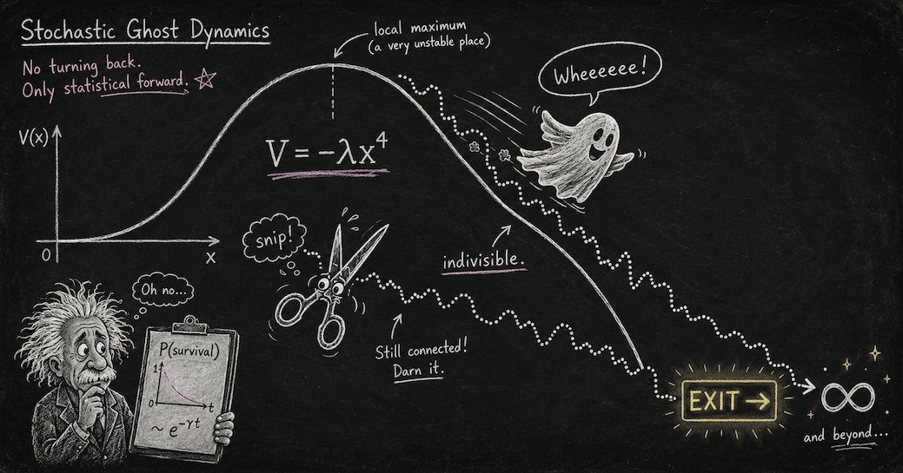

# indivisible-ghosts



<sub>*Banner image: prompt written by Claude Fable 5 (Anthropic), rendered by ChatGPT (OpenAI).*</sub>

Numerical scripts, lab notes, and manuscript for:

> **Indivisible stochastic processes for non-Hermitian and higher-derivative
> quantum systems: detailed balance, broken PT symmetry, and the explosion of
> ghosts** — Jonathan Torkelson (2026).
> **[Read the paper (PDF)](indivisible-ghosts-paper.pdf)**

The project connects two threads: Jacob Barandes' reconstruction of quantum
mechanics as indivisible stochastic processes, and pseudo-Hermitian / PT-symmetric
quantum mechanics (Bender, Mostafazadeh, Mannheim), including the Pais–Uhlenbeck
higher-derivative oscillator and its ghost problem. Headline results:

- **Detailed-balance theorem (K1–K4):** exactly which non-Hermitian Hamiltonians
  admit a time-independent ("fixed-beable") diagonal metric — a Kolmogorov cycle
  condition, with the stationary process satisfying detailed balance.
- **Skin-effect obstruction:** the obstruction to fixed beables is an imaginary
  gauge flux; its topological classification is `H¹(G, ℝ)`, realized by the
  Hatano–Nelson model and non-Hermitian skin modes.
- **Terminal indivisibility:** in the PT-broken phase, dynamics become a
  survival-conditioned process that is indivisible *forever* (closed forms), while
  information-backflow measures of non-Markovianity die at the exceptional point —
  the two notions of non-Markovianity dissociate.
- **Explosion of ghosts:** the Ostrogradski instability of interacting
  Pais–Uhlenbeck systems is reinterpreted as *explosion* (sample-space exit) of the
  corresponding stochastic process; a dictionary links classical time-of-flight,
  Weyl limit-point/limit-circle, essential self-adjointness, and Feller
  conservativity, with numerical deficiency evidence, an exact channelization of
  the quartic PU model, and a certified 1D von Neumann deficiency certificate.

## Provenance and status

This research was carried out essentially in its entirety by the large language
model **Claude Fable 5 (Anthropic)**, directed by Jonathan Torkelson, who posed
the research direction, provided iterative review, and takes responsibility for
circulating it. It began with a single question in a Claude Desktop conversation
(preserved verbatim in this repository): *"Is it not possible that the antilinear
PT/time-reversal symmetry element could maybe predict indivisible non-Markovian
processes?"* See the paper's provenance note and "Author contributions and use
of AI" section.

**Timeline.** The question was posed around 6 P.M. on July 10, 2026. The paper
was fully drafted by roughly 11 P.M. the same evening, with extensions continuing
to about 2 A.M. — the research program and manuscript were, in wall-clock terms,
one evening's work. The following morning was spent on adversarial audits
(reference verification, numerics cross-checks, error fixes), figure and
formatting polish, and publication of this repository. The lab notebook's dated
entries (`notes.md`) reflect this chronology.

**Not peer-reviewed.** Numerical claims are reproducible from the scripts below;
analytic claims are stated with proofs or explicit verification checks in the
paper, but none of it has been independently refereed. Read accordingly.

## Contents

| File | What it does |
|---|---|
| `indivisible-ghosts-paper.pdf` | **The paper** (compiled PDF) |
| `notes.md` | Running lab notebook — every result with exact numbers, in order |
| `Conversation_Conformal_Gravity_PT_Barandes.pdf` | The original Claude Desktop conversation where the research question was posed |
| `PT_stochastic_handoff.md` | The project briefing distilled from that conversation, which seeded the working sessions |
| `paper/` | LaTeX source, figures, and `make_figures.py` (regenerates all figures) |
| `scripts/` | All analysis scripts (below) |

Scripts (each is self-contained; docstrings state what is being tested and the
expected output):

| Script | Result |
|---|---|
| `pt_barandes.py` | Baseline stochastic–quantum correspondence checks |
| `fixed_beable_kolmogorov.py` | K1–K4 detailed-balance theorem (200/200 random verifications) |
| `skin_effect_beables.py` | Imaginary-flux obstruction, Hatano–Nelson spectra, NESS currents |
| `skin_topology_beables.py` | Topology of the obstruction: torus, cylinder, Z₂ ladder |
| `dilation_bridge.py` | Broken PT phase as Halmos dilation / survival-conditioned process |
| `lemma_terminal_indivisibility.py` | Closed-form terminal-indivisibility lemma checks |
| `exceptional_point.py` | Exceptional point as coordinate singularity: scaling exponents |
| `pais_uhlenbeck.py` | Free Pais–Uhlenbeck oscillator: spectra, Ehrenfest dynamics |
| `interacting_pu.py` | Interacting ghosts: cascade laws, classical escape survey |
| `quartic_pu_leak.py` | Lattice confinement diagnosis for the quartic PU model |
| `explosion_theorem.py` | Explosion dictionary V1–V5 (time-of-flight, wall sweeps, wormhole completions) |
| `deficiency_multiD.py` | Multidimensional deficiency: channels, S-matrix at infinity |
| `pu_deficiency_evidence.py` | Fock-space drift evidence campaign for PU deficiency |
| `pu_bo_channels.py` | Exact channelization of quartic PU (BCH identity, time-of-flight) |
| `gap_closure_channels.py` | Finite-channel stability theorem checks |
| `completion_candidates.py` | Completion-mechanism diagnostics for the two λ<0 candidates |
| `tail_certificate.py` | No-compact-witness principle / closure-defect diagnostic |
| `glued_certificate_1d.py` | Certified 1D glued von Neumann deficiency certificate |
| `maslov_feasibility.py` | Gaussian-beam (Maslov) feasibility study for the 2D certificate |

## Running

```
pip install numpy scipy matplotlib
python scripts/explosion_theorem.py    # or any other script; each runs standalone
```

Most scripts finish in seconds to a few minutes on a laptop. The paper compiles
with `pdflatex main.tex` (twice) in `paper/`; the tracked copy of the compiled
PDF lives at the repo root as `indivisible-ghosts-paper.pdf`.

## License

MIT (see `LICENSE`).
